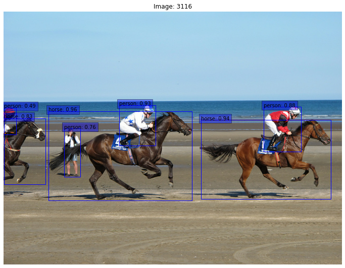
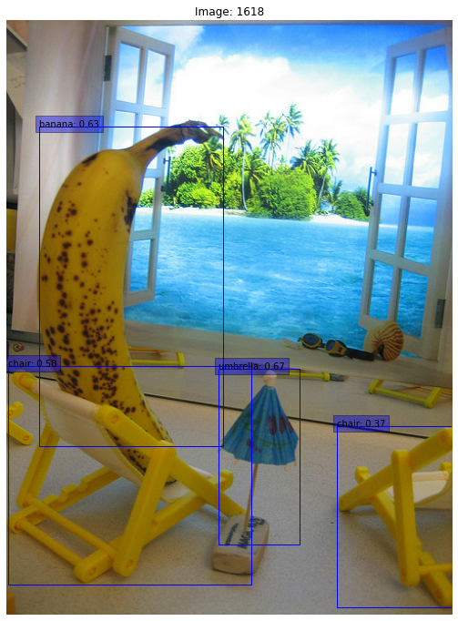
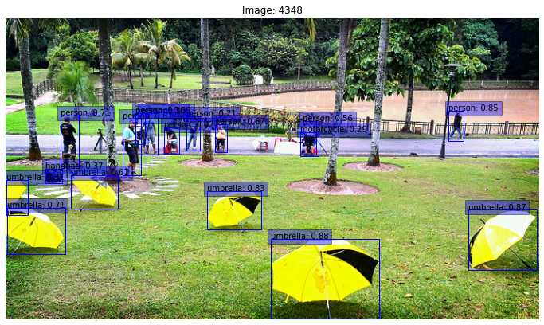

# RetinaNet

#### Supports
 - [x] Performs better than most of the implemetations
 - [x] Multiple ResNet Depths
 - [x] Train on Single/ Multiple GPUs
 - [x] Stable training with Automatic Mixed Precision (~2.5x quicker)
 - [x] Train on TPU/ TPU pods
 - [x] Export `saved_model`
 - [x] COCO mAP evaluation callback
 - [x] Supports fine tuning on custom datasets
 - [x] Supports continuous evaluation
 - [x] Supports all NMS variants `combined`, `per class soft/hard`, `global soft/hard`
 - [x] Supports Batched inference
 - [ ] Add **sotabench** [WIP]
 - [ ] Export TensorRT model
 - [ ] Export Onnx model


## Getting Started
### Training
 - Use `prepare_coco_dataset.sh` to download the COCO2017 dataset and create the tfrecords.
 - If you plan to train on **Google Cloud TPU**, upload the `coco_tfrecords` folder to your **Google Cloud Storage** bucket.
 - `USE_SYNC_BN="" python3 -m retinanet.main --config_path configs/v3-32/retinanet-640-6x-256-tpu-pod.json --log_dir logs --alsologtostderr --is_multi_host` to train, you should now be able to see logs similar to this. (use `--is_multi_host` only when training on **TPU Pods**)

```
I0119 06:09:24.804542 140235606591296 main.py:82] Running on 32 replicas
I0119 06:09:24.885937 140235606591296 trainer.py:69] Setting up model for train
I0119 06:09:52.733288 140235606591296 resnet.py:352] Initialized weights from gs://tfrc_datasets/resnet50/imagenet-ckpt
I0119 06:10:10.742130 140235606591296 builder.py:20] Trainable weights: 285
I0119 06:10:10.742389 140235606591296 builder.py:25] Freezing initial weights
I0119 06:10:10.749390 140235606591296 builder.py:32] Trainable weights after freezing: 252
I0119 06:10:10.879731 140235606591296 builder.py:43] Initial l2_regularization loss 0.4231932759284973
I0119 06:10:11.012778 140235606591296 builder.py:78] Total trainable parameters: 33,865,815
I0119 06:10:11.013074 140235606591296 trainer.py:96] Setting up train dataset
I0119 06:10:11.064891 140235606591296 input_pipeline.py:34] Found 257 train tfrecords matching gs://tfrc_datasets/coco_tfrecords/train*
W0119 06:10:11.074972 140235606591296 input_pipeline.py:50] [Worker ID 0] Using 65/257 train tfrecords
I0119 06:10:11.075413 140235606591296 input_pipeline.py:57] [Worker ID 0] Using per_replica batch_size of 8 for train
I0119 06:10:12.979864 140235606591296 input_pipeline.py:34] Found 257 train tfrecords matching gs://tfrc_datasets/coco_tfrecords/train*
W0119 06:10:12.989384 140235606591296 input_pipeline.py:50] [Worker ID 1] Using 64/257 train tfrecords
I0119 06:10:12.989683 140235606591296 input_pipeline.py:57] [Worker ID 1] Using per_replica batch_size of 8 for train
I0119 06:10:13.460913 140235606591296 input_pipeline.py:34] Found 257 train tfrecords matching gs://tfrc_datasets/coco_tfrecords/train*
W0119 06:10:13.471797 140235606591296 input_pipeline.py:50] [Worker ID 2] Using 64/257 train tfrecords
I0119 06:10:13.472265 140235606591296 input_pipeline.py:57] [Worker ID 2] Using per_replica batch_size of 8 for train
I0119 06:10:13.941818 140235606591296 input_pipeline.py:34] Found 257 train tfrecords matching gs://tfrc_datasets/coco_tfrecords/train*
W0119 06:10:13.952078 140235606591296 input_pipeline.py:50] [Worker ID 3] Using 64/257 train tfrecords
I0119 06:10:13.952428 140235606591296 input_pipeline.py:57] [Worker ID 3] Using per_replica batch_size of 8 for train
I0119 06:10:14.383789 140235606591296 trainer.py:128] Looking for existing checkpoints in gs://tfrc_datasets/model_files/retinanet-640-6x-256-tpu-pod
W0119 06:10:14.452945 140235606591296 trainer.py:146] No existing checkpoints found in gs://tfrc_datasets/model_files/retinanet-640-6x-256-tpu-pod,                 running model in train mode with random weights initialization!
I0119 06:10:14.489678 140235606591296 trainer.py:289] Starting training from step 0 for 33750 steps with 200 steps per execution
I0119 06:10:14.489963 140235606591296 trainer.py:291] Saving checkpoints every 10000 steps in gs://tfrc_datasets/model_files/retinanet-640-6x-256-tpu-pod
I0119 06:10:14.490106 140235606591296 trainer.py:108] Setting up summary writer
I0119 06:10:14.491234 140235606591296 trainer.py:113] Writing summaries to gs://tfrc_datasets/tensorboard/retinanet-640-6x-256-tpu-pod
I0119 06:10:17.358940 140235606591296 tpu.py:1259] Automatic outside compilation is enabled. Ops without XLA kernels will be automatically placed on CPU.
I0119 06:10:55.354405 140235606591296 tpu.py:1259] Automatic outside compilation is enabled. Ops without XLA kernels will be automatically placed on CPU.
I0119 06:11:38.859327 140235606591296 tpu.py:1259] Automatic outside compilation is enabled. Ops without XLA kernels will be automatically placed on CPU.
I0119 06:12:10.568544 140235606591296 tpu.py:1259] Automatic outside compilation is enabled. Ops without XLA kernels will be automatically placed on CPU.
I0119 06:16:43.704283 140235606591296 trainer.py:344] [global_step 200/33750] [ETA: 17:19:16] [137.74 imgs/s] {'box-loss': 0.007, 'class-loss': 0.694, 'weighted-loss': 1.029, 'l2-regularization': 0.419, 'total-loss': 1.448, 'gradient-norm': 4.354, 'execution-time': 371.72, 'learning-rate': 0.069}
I0119 06:17:23.686627 140235606591296 trainer.py:344] [global_step 400/33750] [ETA: 01:50:14] [1290.65 imgs/s] {'box-loss': 0.006, 'class-loss': 0.547, 'weighted-loss': 0.84, 'l2-regularization': 0.407, 'total-loss': 1.246, 'gradient-norm': 4.103, 'execution-time': 39.67, 'learning-rate': 0.132}
I0119 06:18:04.471802 140235606591296 trainer.py:344] [global_step 600/33750] [ETA: 01:52:19] [1259.22 imgs/s] {'box-loss': 0.006, 'class-loss': 0.509, 'weighted-loss': 0.791, 'l2-regularization': 0.388, 'total-loss': 1.18, 'gradient-norm': 3.857, 'execution-time': 40.66, 'learning-rate': 0.195}

```
___
### Running Inference
```python
image_dir = '~/coco2017/val2017'
images = sorted(glob(image_dir + '/*'))
print('Found {} images in {}'.format(len(images), image_dir))

#  Load label mapping
with open('coco_label_map.json', 'r') as f:
    label_map = json.load(f)

#  Load `saved_model`
model = tf.saved_model.load('model_files/retinanet-1024-30x-64-tpu')
serving_fn = model.signatures['serving_default']

idx = 336
image = read_image(images[idx])

tik = time()
detections = serving_fn(image=image, image_id=tf.constant(idx))
toc = time()

valid_detections = detections['valid_detections'].numpy()
boxes = detections['boxes'][:valid_detections].numpy()
classes = [
    label_map[str(idx)]
    for idx in detections['class_ids'][:valid_detections].numpy()
]
scores = detections['scores'][:valid_detections].numpy()

#  Visualize detections
visualize_detections(image,
                     boxes,
                     classes,
                     scores,
                     title='Image: {}'.format(idx),
                     save=False,
                     filename='outputs/image_{}.png'.format(idx))

print('Inference time: {:.2f} ms'.format((toc - tik) * 1000))
```
___
### Visualizations

<table>
  <tr>
    <td valign="top"></td>
    <td valign="top"></td>
    <td valign="top"></td>
    <td valign="top"></td>
  </tr>
 </table>

___
### Results 
<pre>
 - Training Dataset    : COCO2017 train split
 - Evaluation Dataset  : COCO2017 validation split
 - Backbone            : ResNet50 v1 trained on ImageNet
 - Schedule            : 3x (1x is ~12 epochs)
 - Time required       : 50mins
 - System              : v3-32 TPU pod
</pre> 
 ```
 Average Precision  (AP) @[ IoU=0.50:0.95 | area=   all | maxDets=100 ] = 0.377
 Average Precision  (AP) @[ IoU=0.50      | area=   all | maxDets=100 ] = 0.570
 Average Precision  (AP) @[ IoU=0.75      | area=   all | maxDets=100 ] = 0.401
 Average Precision  (AP) @[ IoU=0.50:0.95 | area= small | maxDets=100 ] = 0.177
 Average Precision  (AP) @[ IoU=0.50:0.95 | area=medium | maxDets=100 ] = 0.426
 Average Precision  (AP) @[ IoU=0.50:0.95 | area= large | maxDets=100 ] = 0.551
 Average Recall     (AR) @[ IoU=0.50:0.95 | area=   all | maxDets=  1 ] = 0.315
 Average Recall     (AR) @[ IoU=0.50:0.95 | area=   all | maxDets= 10 ] = 0.492
 Average Recall     (AR) @[ IoU=0.50:0.95 | area=   all | maxDets=100 ] = 0.520
 Average Recall     (AR) @[ IoU=0.50:0.95 | area= small | maxDets=100 ] = 0.278
 Average Recall     (AR) @[ IoU=0.50:0.95 | area=medium | maxDets=100 ] = 0.588
 Average Recall     (AR) @[ IoU=0.50:0.95 | area= large | maxDets=100 ] = 0.710
 ```

___
### Tensorboard


___
#### To-Do
 - [x] Train on ResNet18, 34, 101
 - [x] Add models trained with 30x schedule, without imagenet pretrained weights
 - [x] Support Input Sharding for TPU Pod
 - [x] COCO mAP evaluation callback
 - [ ] Support fine tuning and training with other datasets
 - [ ] Add fine-tuning example
 - [ ] Add MobileNetV3 Backbone

```
@misc{1708.02002,
Author = {Tsung-Yi Lin and Priya Goyal and Ross Girshick and Kaiming He and Piotr Dollár},
Title = {Focal Loss for Dense Object Detection},
Year = {2017},
Eprint = {arXiv:1708.02002},
}
```
