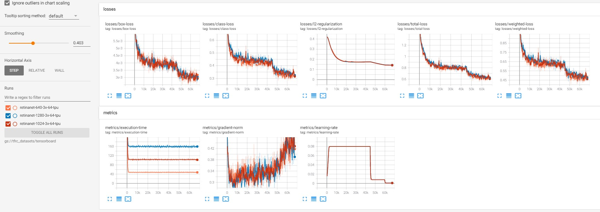

# RetinaNet

### Models
## ResNet50
| Input Shape | COCO val2017 mAP | Link | Training Time on TPU v3-8 |
| --- | --- | --- |  --- |
| **640x640** | 36.8 | [checkpoint](https://github.com/srihari-humbarwadi/retinanet-tensorflow2.x) / [config](configs/retinanet-640-3x-64-tpu.json) | ~3h |
| **1024x1024** | 40.2 | [checkpoint](https://github.com/srihari-humbarwadi/retinanet-tensorflow2.x) / [config](configs/retinanet-1026-3x-64-tpu.json) | ~6.5h |
| **1280x1280** | **40.5** | [checkpoint](https://github.com/srihari-humbarwadi/retinanet-tensorflow2.x) / [config](configs/retinanet-1280-3x-64-tpu.json) | ~10.5h |

 - *Above models use imagenet pretrained backbone.*
 - *The models are trained with the 3x training schedule, where 1x schedule is ~12 epochs. The learning rate schedule is adjusted accordingly.*

## ResNet34
| Input Shape | COCO val2017 mAP | Link | Training Time on TPU v3-8 |
| --- | --- | --- |  --- |
| **640x640** | *under training* | [checkpoint](https://github.com/srihari-humbarwadi/retinanet-tensorflow2.x) / [config](configs/retinanet-34-640-30x-64-tpu.json) | ~28h |
| **1024x1024** | *under training* | [checkpoint](https://github.com/srihari-humbarwadi/retinanet-tensorflow2.x) / [config](configs/retinanet-34-1024-30x-64-tpu.json) | ~68h |

## ResNet101
| Input Shape | COCO val2017 mAP | Link | Training Time on TPU v3-8 |
| --- | --- | --- |  --- |
| **640x640** | 40.2 | [checkpoint](https://github.com/srihari-humbarwadi/retinanet-tensorflow2.x) / [config](configs/retinanet-101-640-30x-64-tpu.json) | ~38h |
| **1024x1024** | *under training* | [checkpoint](https://github.com/srihari-humbarwadi/retinanet-tensorflow2.x) / [config](configs/retinanet-101-1024-30x-64-tpu.json) | ~96h |

 - *Above models use randomly initialized backbones.*
 - *The models are trained with the **30x** training schedule, where 1x schedule is ~12 epochs. The learning rate schedule is adjusted accordingly.*

## ResNet152
| Input Shape | COCO val2017 mAP | Link | Training Time on TPU v3-8 |
| --- | --- | --- |  --- |
| **640x640** | *under training* | [checkpoint](https://github.com/srihari-humbarwadi/retinanet-tensorflow2.x) / [config](configs/retinanet-151-640-50x-64-tpu.json) | ~80h |

 - *Above model uses randomly initialized backbone.*
 - *The models are trained with the **50x** training schedule, where 1x schedule is ~12 epochs. The learning rate schedule is adjusted accordingly.*
### Tensorboard



## Getting Started
 - Use `prepare_coco_dataset.sh` to download the COCO2017 dataset and create the tfrecords.
 - If you plan to train on **Google Cloud TPU**, upload the `coco_tfrecords` folder to your **Google Cloud Storage** bucket.
 - `python3 -m retinanet.main --config_path configs/<config name>.json --debug` to train, you should now be able to see logs similar to this
```
I1026 09:23:09.476862 140424579548992 trainer.py:77] Setting up train dataset
I1026 09:23:09.533261 140424579548992 input_pipeline.py:30] Found 256 train tfrecords matching gs://tfrc_datasets/coco_tfrecords/train*
I1026 09:23:11.362147 140424579548992 trainer.py:92] Looking for existing checkpoints in gs://tfrc_datasets/model_files/retinanet-101-640-30x-64-tpu
I1026 09:23:11.468965 140424579548992 trainer.py:104] No existing checkpoints found in gs://tfrc_datasets/model_files/retinanet-101-640-30x-64-tpu, training from scratch!
I1026 09:23:11.488565 140424579548992 trainer.py:184] Starting training from step 0 for 675000 steps with 250 steps per execution
I1026 09:23:11.488853 140424579548992 trainer.py:186] Saving checkpoints every 50000 steps in gs://tfrc_datasets/model_files/retinanet-101-640-30x-64-tpu
I1026 09:23:11.489072 140424579548992 trainer.py:83] Setting up summary writer
I1026 09:23:11.491212 140424579548992 trainer.py:88] Writing summaries to gs://tfrc_datasets/tensorboard/retinanet-101-640-30x-64-tpu
I1026 09:23:12.733609 140424579548992 tpu.py:1238] Automatic outside compilation is enabled. Ops without XLA kernels will be automatically placed on CPU.
I1026 09:23:54.162838 140424579548992 tpu.py:1238] Automatic outside compilation is enabled. Ops without XLA kernels will be automatically placed on CPU.
I1026 09:24:38.644693 140424579548992 tpu.py:1238] Automatic outside compilation is enabled. Ops without XLA kernels will be automatically placed on CPU.
I1026 09:25:19.810285 140424579548992 tpu.py:1238] Automatic outside compilation is enabled. Ops without XLA kernels will be automatically placed on CPU.
I1026 09:30:40.215446 140424579548992 trainer.py:239] [global_step 250/675000] [ETA: 332:11:12] [36.11 imgs/s] {'box-loss': 0.01, 'class-loss': 1.128, 'weighted-loss': 1.634, 'l2-regularization': 2.772, 'total-loss': 4.406, 'gradient-norm': 0.414, 'execution-time': 443.08, 'learning-rate': 0.008}
I1026 09:31:33.522529 140424579548992 trainer.py:239] [global_step 500/675000] [ETA: 39:49:04] [301.15 imgs/s] {'box-loss': 0.01, 'class-loss': 1.008, 'weighted-loss': 1.499, 'l2-regularization': 2.762, 'total-loss': 4.261, 'gradient-norm': 0.388, 'execution-time': 53.13, 'learning-rate': 0.009}
I1026 09:32:26.712022 140424579548992 trainer.py:239] [global_step 750/675000] [ETA: 39:42:21] [301.89 imgs/s] {'box-loss': 0.01, 'class-loss': 0.981, 'weighted-loss': 1.471, 'l2-regularization': 2.749, 'total-loss': 4.22, 'gradient-norm': 0.35, 'execution-time': 53.0, 'learning-rate': 0.009}
I1026 09:33:19.951558 140424579548992 trainer.py:239] [global_step 1000/675000] [ETA: 39:44:36] [301.49 imgs/s] {'box-loss': 0.009, 'class-loss': 0.942, 'weighted-loss': 1.409, 'l2-regularization': 2.736, 'total-loss': 4.145, 'gradient-norm': 0.385, 'execution-time': 53.07, 'learning-rate': 0.01}
I1026 09:34:13.216273 140424579548992 trainer.py:239] [global_step 1250/675000] [ETA: 39:46:25] [301.15 imgs/s] {'box-loss': 0.009, 'class-loss': 0.934, 'weighted-loss': 1.39, 'l2-regularization': 2.722, 'total-loss': 4.111, 'gradient-norm': 0.411, 'execution-time': 53.13, 'learning-rate': 0.011}
I1026 09:35:06.289964 140424579548992 trainer.py:239] [global_step 1500/675000] [ETA: 39:37:27] [302.17 imgs/s] {'box-loss': 0.009, 'class-loss': 0.953, 'weighted-loss': 1.399, 'l2-regularization': 2.706, 'total-loss': 4.105, 'gradient-norm': 0.441, 'execution-time': 52.95, 'learning-rate': 0.012}
I1026 09:35:59.451853 140424579548992 trainer.py:239] [global_step 1750/675000] [ETA: 39:37:55] [302.00 imgs/s] {'box-loss': 0.009, 'class-loss': 0.91, 'weighted-loss': 1.351, 'l2-regularization': 2.689, 'total-loss': 4.041, 'gradient-norm': 0.399, 'execution-time': 52.98, 'learning-rate': 0.013}
I1026 09:36:52.646378 140424579548992 trainer.py:239] [global_step 2000/675000] [ETA: 39:40:10] [301.60 imgs/s] {'box-loss': 0.008, 'class-loss': 0.824, 'weighted-loss': 1.224, 'l2-regularization': 2.672, 'total-loss': 3.896, 'gradient-norm': 0.38, 'execution-time': 53.05, 'learning-rate': 0.014}
I1026 09:37:45.771663 140424579548992 trainer.py:239] [global_step 2250/675000] [ETA: 39:35:42] [302.06 imgs/s] {'box-loss': 0.008, 'class-loss': 0.904, 'weighted-loss': 1.306, 'l2-regularization': 2.653, 'total-loss': 3.959, 'gradient-norm': 0.428, 'execution-time': 52.97, 'learning-rate': 0.015}
I1026 09:38:39.022006 140424579548992 trainer.py:239] [global_step 2500/675000] [ETA: 39:40:39] [301.32 imgs/s] {'box-loss': 0.008, 'class-loss': 0.79, 'weighted-loss': 1.199, 'l2-regularization': 2.633, 'total-loss': 3.832, 'gradient-norm': 0.372, 'execution-time': 53.1, 'learning-rate': 0.016}

```

#### To-Do
 - [ ] Add MobileNetV3 Backbone
 - [ ] Train on ResNet18, 34, 101
 - [ ] Add models trained with 30x schedule, without imagenet pretrained weights
 - [ ] Support Input Sharding for TPU Pod
 - [x] COCO mAP evaluation callback
 - [ ] Add fine-tuning example

```
@misc{1708.02002,
Author = {Tsung-Yi Lin and Priya Goyal and Ross Girshick and Kaiming He and Piotr Dollár},
Title = {Focal Loss for Dense Object Detection},
Year = {2017},
Eprint = {arXiv:1708.02002},
}
```
